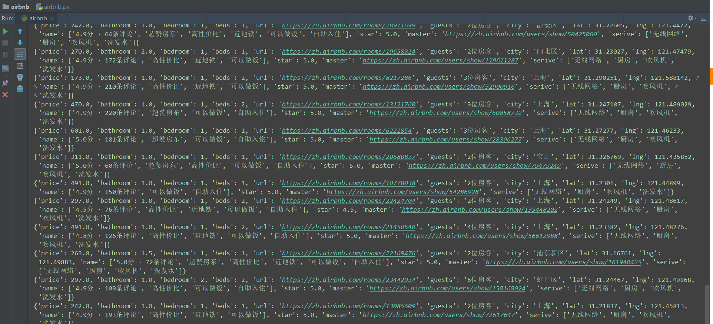

[](https://www.python.org/downloads/)


- 该项目会长期更新。
- 欢迎提issue，维护者看到后都会积极回答。

## 快速开始 :octocat:

1.运行

```
    1.获取爱彼迎网站房源信息
        - 房源纬度
        - 房源经度
        - 房源名称标题
        - 房源评分星级
        - 房源标签
        - 房源提供服务
        - 卫生间，卧室，床，房客数量   等有效数据字段

    2.获取房源用户评论信息
```

- 运行 airbnb.py
 

```
传入关键词（地区，如：上海）
会自动抓取网站搜索出来的所有有关房源信息

```


2.效果图




## 重要声明 :loudspeaker:
该项目开发的初衷是为了学术研究，已经**严格控制爬虫的速度**。


